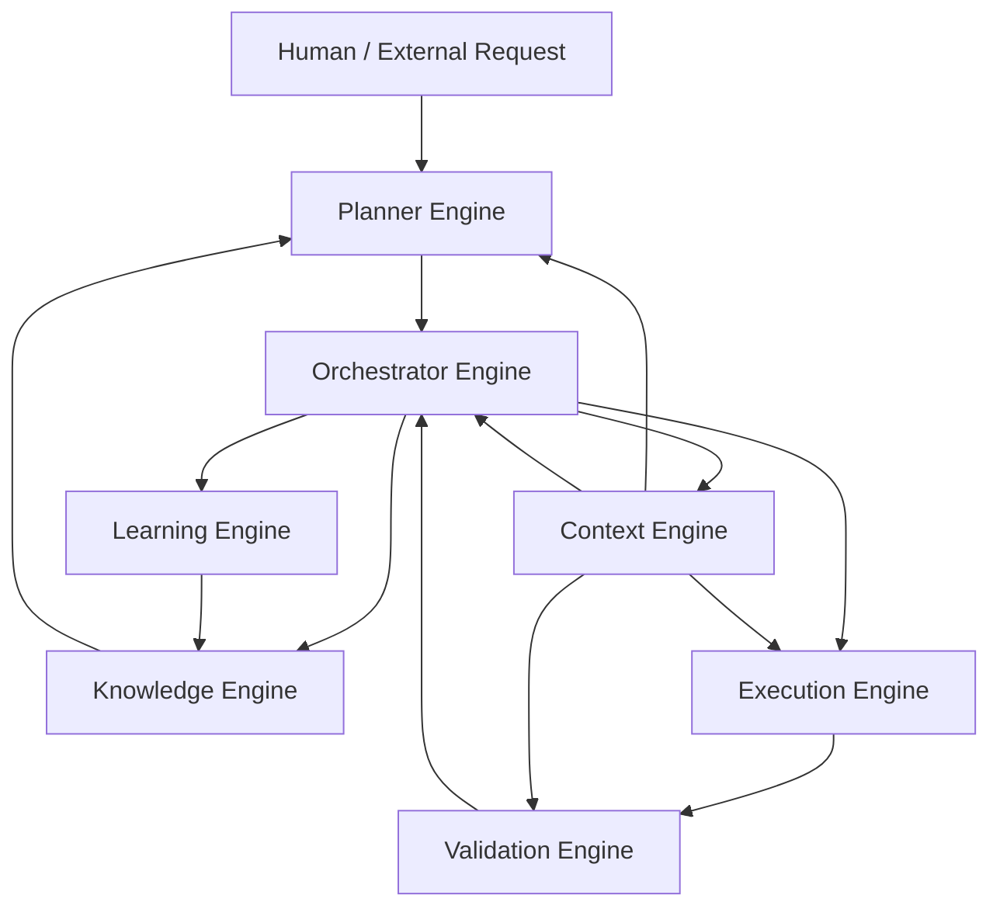

# ARCHITECTURE

**Document Class:** Technical Governance
**Authority:** Subordinate to `constitution.md` and `security_policy.md`. Superior to `current_phase.md` and code-level decisions.
**Purpose:** The canonical description of system structure. Until Phase 003 (Architecture Design) is executed for a specific product, this document defines the **architectural principles and default patterns** every future design must follow, rather than a concrete system diagram.

---

## 1. Status

**Update (2026-07-08): Phase 003 (Architecture Design) is complete.** The concrete architecture for Titan AI itself — the **Titan Core** engine architecture — is approved and binding. See Section 6 below. This supersedes the prior "principles-only" status. Sections 2–5 remain in force as the general architectural principles that Titan Core, and anything Titan Core builds, must also comply with; Section 6 is the concrete design layered on top of them. See `decisions.md` ADR-0002 for the full rationale and trade-offs behind this decision.

---

## 2. Architectural Principles (Binding on All Future Designs)

1. **Separation of concerns by layer.** Domain logic, application/use-case logic, and infrastructure/IO must be separable. No domain logic may directly depend on a specific database, framework, or transport.
2. **Explicit boundaries over implicit coupling.** Modules communicate through defined interfaces/contracts, not shared mutable state or reach-through imports.
3. **Single source of truth per concern.** Configuration lives in one place (see `Config Manager` pattern below), state lives in one place, and this governance layer is the single source of truth for process/decisions.
4. **Fail loud in development, fail safe in production.** Errors must never be silently swallowed. Development environments surface errors immediately; production environments degrade gracefully and log comprehensively.
5. **Composability over monoliths.** Prefer small, well-tested, independently deployable/testable units over large multi-purpose modules, without over-engineering microservices where a modular monolith suffices.
6. **Observability is architecture, not an afterthought.** Logging, metrics, and tracing hooks are part of the initial design, not bolted on later.
7. **Security boundaries are architectural boundaries.** Trust boundaries (e.g., user input, third-party APIs, filesystem, network) must be explicit in the design, per `security_policy.md`.

## 3. Default Structural Pattern (Reference Template)

Unless Phase 003 records an explicit deviation via ADR, new codebases under Titan AI governance should default to this structure:

```
/src
  /domain          — pure business logic, no framework/IO dependencies
  /application      — use cases / orchestration, depends on domain only
  /infrastructure  — DB, filesystem, network, third-party SDKs
  /interfaces       — CLI, HTTP API, UI entry points
  /shared          — cross-cutting types/utilities with no business logic
/tests
  /unit
  /integration
  /e2e
```

For monorepos (e.g., Electron-style apps with main/renderer/shared processes), this maps to packages: `packages/shared`, `packages/main` (infrastructure + application), `packages/renderer` (interfaces), with domain logic kept framework-agnostic inside `packages/shared` or a dedicated `packages/core`.

## 4. Core Services Pattern

Cross-cutting concerns (logging, configuration, error handling) are implemented once as dedicated services and consumed everywhere, never duplicated:

- **Logger Service** — structured, leveled logging; single instance; no `console.log` scattered through business code.
- **Config Manager** — single source of truth for configuration, environment-aware, validated at startup (fail fast on invalid config), never read directly from `process.env` outside this service.
- **Error/Result Handling** — prefer explicit result/error types over unchecked exceptions crossing module boundaries where the language/ecosystem supports it.

## 5. Data Flow Principles

1. Data enters the system only through defined interfaces (`/interfaces`), never directly into `/domain`.
2. All external data (user input, API responses, files) is validated/sanitized at the boundary before entering application logic.
3. Mutations to persistent state go through the application layer, never directly from `/interfaces` to `/infrastructure`.

## 6. Titan Core Architecture (Approved)

**Status:** Approved via ADR-0002 (`decisions.md`). This is the concrete architecture of Titan AI itself — the autonomous engineering system this `.titan/` governance layer supports. It is the product of Phase 003.

### 6.1 Overview

Titan AI is composed of seven cooperating engines, collectively called **Titan Core**. Each engine has a single, non-overlapping responsibility. No engine may perform another engine's job, even temporarily or "just this once" — boundary violations must go through an ADR, not an ad hoc shortcut.



### 6.2 Engine Definitions

**Planner Engine**
- **Responsibility:** Translates a goal (a human request, a roadmap phase, or a re-plan triggered by validation failure) into a concrete, ordered, executable plan — a sequence of tasks with dependencies, using `roadmap.md`/`phases/` structure as its output shape.
- **Consumes:** Goals/requirements; historical precedent and constraints from the Knowledge Engine; current situational state from the Context Engine.
- **Produces:** A structured plan object (tasks, dependencies, acceptance criteria) handed to the Orchestrator Engine.
- **Boundary:** The Planner Engine never executes anything and never talks to the Execution Engine directly. It has no authority to mark anything "done" — only the Validation Engine, via the Orchestrator, can do that. It re-plans when the Orchestrator reports a validation failure, but it does not retry low-level actions itself.

**Orchestrator Engine**
- **Responsibility:** The central coordinator. Takes a plan from the Planner Engine and drives it to completion: sequencing tasks, respecting dependencies, dispatching work to the Execution Engine, routing results to the Validation Engine, and deciding (per `constitution.md` escalation rules) when to proceed, retry, re-plan, or escalate to a human.
- **Consumes:** Plans (from Planner), context snapshots (from Context Engine), governance rules (from Knowledge Engine, i.e., the `.titan/` documents).
- **Produces:** Task dispatches to the Execution Engine; task outcomes back to the Planner Engine (for re-planning) and Learning Engine (for observation).
- **Boundary:** The Orchestrator does not decide *what* to build (that's the Planner) and does not *perform* the work itself (that's the Execution Engine). It is pure coordination and policy enforcement — it is the only engine authorized to invoke the escalation rules in `rules/03-escalation-rules.md`.

**Context Engine**
- **Responsibility:** Maintains the live, ephemeral working state of the current session/task: active phase, in-flight task, recent conversation/session history, current file/system state snapshots. This is Titan AI's short-term memory.
- **Consumes:** Live signals from every other engine as they operate.
- **Produces:** On-demand context snapshots served to Planner, Orchestrator, Execution, and Validation engines so each can act with full situational awareness without querying each other directly.
- **Boundary:** The Context Engine is session-scoped and disposable — it does not persist knowledge across sessions (that is the Knowledge Engine's job) and holds no authority to make decisions; it only serves state. When a session ends, its content is either promoted into the Knowledge Engine (as a session log, per `sessions/`) or discarded.

**Knowledge Engine**
- **Responsibility:** Titan AI's long-term memory. Owns and serves the entire `.titan/` governance corpus: constitution, architecture, decisions, past sessions, phases, rules, and any learned heuristics. It is the authoritative interface through which every other engine reads governance and history.
- **Consumes:** Updates from the Learning Engine (new heuristics, patterns), new ADRs and session logs as they are written, human amendments to governance documents.
- **Produces:** Governance rules, historical precedent, and prior decisions served to the Planner, Orchestrator, and Execution engines on request.
- **Boundary:** The Knowledge Engine is read/write over persistent knowledge only — it never holds live/ephemeral session state (Context Engine's job) and never makes a decision on its own; it answers queries and stores what it's told to store. It cannot unilaterally alter `constitution.md` — amendments still require the human-gated process in `constitution.md` Section 8.

**Execution Engine**
- **Responsibility:** Performs the concrete, low-level work: writing and editing code, running commands, calling external APIs/tools, modifying files. This is Titan AI's "hands."
- **Consumes:** Task dispatches from the Orchestrator Engine, plus the context it needs from the Context Engine to perform the task correctly.
- **Produces:** Raw outcomes (files changed, commands run, outputs/errors produced), reported back to the Orchestrator Engine and handed to the Validation Engine for verification.
- **Boundary:** The Execution Engine has zero planning or approval authority. It does exactly what it is dispatched to do, nothing more (no silent scope expansion, per `constitution.md` Section 3.4) and nothing less (no silent scope reduction, per Section 3.5). It never marks its own work "done" — that determination belongs to the Validation Engine.

**Validation Engine**
- **Responsibility:** Independently verifies Execution Engine output against the task's acceptance criteria and against `testing_strategy.md`, `coding_standards.md`, and `security_policy.md`. Runs or checks tests, lint/standards compliance, and security checks; flags fabricated or mocked results.
- **Consumes:** Execution Engine outcomes, acceptance criteria from the Planner's original plan, and standards from the Knowledge Engine.
- **Produces:** A pass/fail/partial verdict with specific findings, returned to the Orchestrator Engine.
- **Boundary:** The Validation Engine is strictly read-only with respect to the deliverable under test — it verifies, it does not fix. If something fails, that outcome routes back through the Orchestrator to the Planner (to re-plan) or Execution Engine (to redo), never patched directly by the Validation Engine itself. This separation guarantees no engine can grade its own work.

**Learning Engine**
- **Responsibility:** Observes full task/phase cycles (plan → execute → validate → outcome) and distills durable lessons: what patterns worked, what failed and why, what estimates were wrong. Converts these observations into updates for the Knowledge Engine (new precedent, refined heuristics) so future Planner cycles improve.
- **Consumes:** Outcomes and verdicts from the Orchestrator Engine across completed tasks/phases.
- **Produces:** Proposed updates to the Knowledge Engine — new or revised heuristics, proposed ADRs for recurring architectural friction, flagged recurring risks.
- **Boundary:** The Learning Engine can *propose* new knowledge and even draft ADRs, but it cannot unilaterally rewrite `constitution.md`, `security_policy.md`, or accept its own proposed ADRs — those still require the approval path defined in `constitution.md` and `decisions.md`. It observes and proposes; it does not decide or execute.

### 6.3 Cross-Cutting Rules for All Seven Engines

1. Every engine-to-engine interaction is an explicit, inspectable call — never implicit shared state. This extends architectural principle 2 (Section 2) to Titan Core specifically.
2. No engine bypasses the Orchestrator to invoke another engine directly, **except** reads from the Context Engine and Knowledge Engine, which any engine may query directly (they are pure state/knowledge providers, not decision-makers).
3. Every engine's inputs and outputs must be logged in a form the Context Engine (short-term) and, where significant, the Knowledge Engine (long-term, via `sessions/`) can capture — this keeps Titan Core itself compliant with `constitution.md` Section 3.3 ("leave a trail").
4. Engine boundaries described here are binding. A future agent that finds a boundary awkward must raise an ADR to revise it, not quietly blend two engines' responsibilities together.

### 6.4 Engine Framework (Required Shared Infrastructure)

**Status:** Required for all future Titan engine implementation phases. This framework is now part of the approved architecture and must be established before additional engines are implemented.

Every Titan engine must inherit from, or implement, a shared Engine Framework that provides the common runtime contract used by all engines. The framework is the boundary-enforcing layer for engine lifecycle, communication, and shared infrastructure. It exists to ensure that engines remain independently testable, replaceable, and interoperable without relying on ad hoc coupling.

The Engine Framework must provide:

- **Engine lifecycle** — startup, initialization, execution, pause/resume where applicable, and orderly shutdown.
- **Standard engine interface** — a common contract that every engine implements or inherits.
- **Public engine API contract** — the mandatory interface and behavior defined in `specification/engine_api.md`.
- **Engine registry** — a central registry of available engines and their capabilities.
- **Dependency injection** — a standard way to supply services and collaborators to engines.
- **Internal event bus** — a shared mechanism for asynchronous, observable engine-to-framework and framework-to-engine communication.
- **Structured logging** — consistent, contextual logging across all engines.
- **Configuration loading** — centralized, validated configuration access for each engine.
- **Health monitoring** — runtime health signals, readiness checks, and fault visibility.
- **Metrics hooks** — common hooks for counters, timing, and other runtime metrics.
- **Error handling** — consistent error propagation, classification, and recovery behavior.
- **Graceful shutdown** — orderly termination with cleanup and state preservation where appropriate.
- **Capability discovery** — a standardized way for the framework or other engines to discover what an engine can do.

Engines must never communicate directly unless explicitly allowed by an approved interface or ADR. All communication should occur through the Engine Framework using events or approved interfaces. This keeps engine boundaries explicit and allows future distributed execution, replacement, or isolation of individual engines without reworking the whole system.

## 6.5 Mapping to the Default Structural Pattern (Section 3)

Each engine is implemented as its own module respecting the `/domain`, `/application`, `/infrastructure`, `/interfaces` layering from Section 3 internally. Suggested package layout once Phase 002 selects a stack:

```
/src
  /engines
    /planner
    /orchestrator
    /context
    /knowledge
    /execution
    /validation
    /learning
  /shared        — cross-engine types/contracts (e.g., Plan, Task, Verdict)
  /interfaces    — human-facing entry points (CLI/UI/API) that address the Orchestrator only
```

No engine imports another engine's internals directly — only its published contract types from `/shared`.

## 7. Extension Protocol

When Phase 003 (or any future architecture work) adds concrete design decisions:

1. Append new sections to this file rather than rewriting Sections 1–6 unless a principle is being formally revised.
2. Any deviation from Sections 1–6 requires an ADR in `decisions.md` explaining why the default pattern doesn't fit.
3. Diagrams should be included as Mermaid code blocks for portability across tools and agents.

## 8. Anti-Patterns (Explicitly Disallowed)

- God objects/modules that own unrelated responsibilities.
- Business logic embedded in UI components or route handlers.
- Configuration values hardcoded and duplicated across files.
- Silent fallback to mock/fake data in place of real integration, without explicit, visible marking and an accompanying ADR.
- Circular dependencies between layers.
- Any engine performing another engine's responsibility (e.g., Execution Engine deciding it "knows better" and re-planning; Validation Engine patching the code it's supposed to be checking).
- The Orchestrator Engine containing planning logic or execution logic inline instead of delegating to the Planner and Execution engines.
- The Learning Engine directly mutating `constitution.md`, `security_policy.md`, or accepting its own proposed ADRs without the human-gated approval path.
